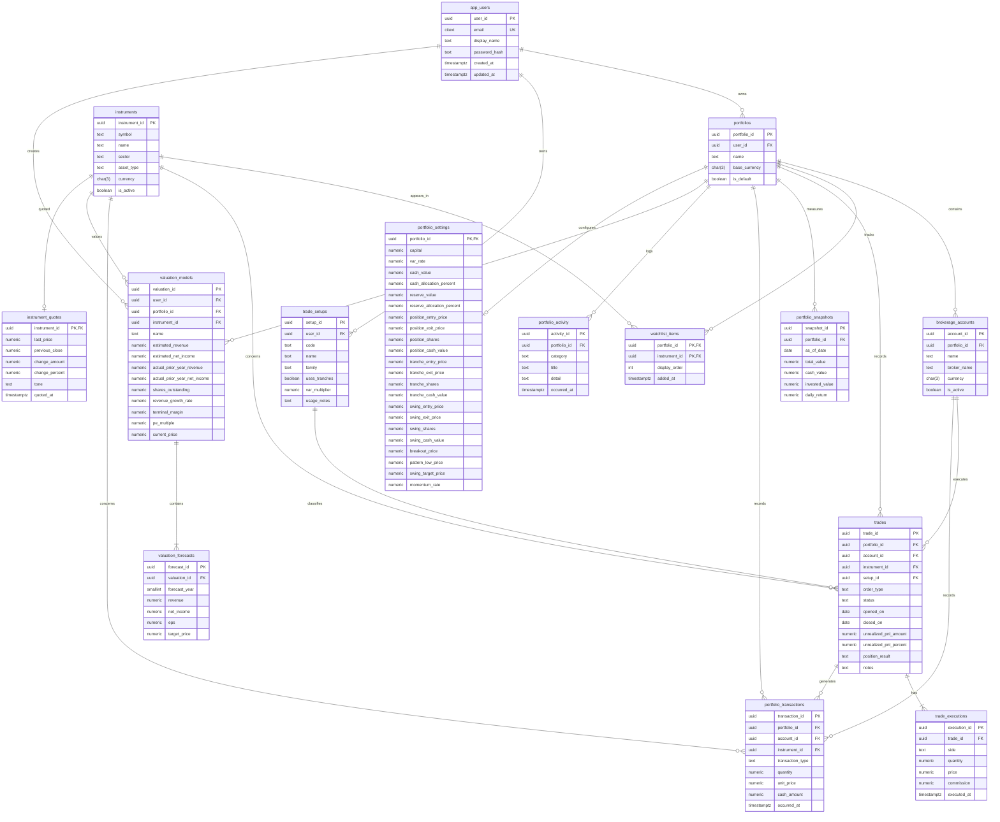

# Arcana Ledger database schema

This document is the proposed relational model for the trading dashboard. The DDL targets PostgreSQL 16+ and is intentionally independent of the current mock frontend data. Amounts are stored as `numeric`, never floating point, and timestamps are stored in UTC with `timestamptz`.

## Entity relationship diagram



## Table catalog

| Table | Purpose |
| --- | --- |
| `app_users` | Application identity and password hash. Authentication providers should own password verification. |
| `portfolios` | A user's portfolio boundary, base currency, and default selection. |
| `brokerage_accounts` | Optional broker/custodian accounts within a portfolio. |
| `instruments` | Canonical securities or other tradable assets, keyed by symbol and asset type. |
| `watchlist_items` | Portfolio-specific instrument watchlists. |
| `instrument_quotes` | Latest cached price/change per instrument, so the dashboard and watchlist never call a market data API on the read path. |
| `trade_setups` | Reusable setup definitions such as Boomer or Blue Sky Breakout, including the "when to use" guidance shown on the Configuration page. |
| `trades` | A logical position or trade thesis, including status, entry/exit targets, and a cached unrealized P&L used by the Trades table. |
| `trade_executions` | The fills/tranches that make up a trade. This preserves the execution history instead of overwriting it. |
| `portfolio_transactions` | Complete cash and position ledger for buys, sells, fees, dividends, deposits, and withdrawals. |
| `portfolio_snapshots` | Daily portfolio metrics used by dashboard charts and return calculations. |
| `portfolio_activity` | Recent activity feed entries (trade logged, valuation saved, risk alert) shown on the dashboard. |
| `valuation_models` | Saved valuation assumptions for an instrument, matching the Valuation page inputs. |
| `valuation_forecasts` | One row per forecast year produced by a valuation model. |
| `portfolio_settings` | Portfolio risk, reserve, and per-setup position-sizing defaults shown on the Configuration page, with allocation percentages as generated columns. |

## PostgreSQL DDL

Run this as an initial migration. Application migrations should add columns or tables in later revisions rather than editing an already-applied migration.

```sql
CREATE EXTENSION IF NOT EXISTS citext;
CREATE EXTENSION IF NOT EXISTS pgcrypto;

CREATE TABLE app_users (
	user_id uuid PRIMARY KEY DEFAULT gen_random_uuid(),
	email citext NOT NULL UNIQUE,
	display_name text NOT NULL CHECK (length(trim(display_name)) BETWEEN 1 AND 120),
	password_hash text NOT NULL,
	created_at timestamptz NOT NULL DEFAULT now(),
	updated_at timestamptz NOT NULL DEFAULT now()
);

CREATE TABLE portfolios (
	portfolio_id uuid PRIMARY KEY DEFAULT gen_random_uuid(),
	user_id uuid NOT NULL REFERENCES app_users(user_id) ON DELETE CASCADE,
	name text NOT NULL CHECK (length(trim(name)) BETWEEN 1 AND 120),
	base_currency char(3) NOT NULL DEFAULT 'CAD' CHECK (base_currency ~ '^[A-Z]{3}$'),
	is_default boolean NOT NULL DEFAULT false,
	created_at timestamptz NOT NULL DEFAULT now(),
	updated_at timestamptz NOT NULL DEFAULT now(),
	UNIQUE (user_id, portfolio_id)
);

CREATE UNIQUE INDEX ux_portfolios_one_default_per_user
	ON portfolios (user_id) WHERE is_default;

CREATE TABLE brokerage_accounts (
	account_id uuid PRIMARY KEY DEFAULT gen_random_uuid(),
	portfolio_id uuid NOT NULL REFERENCES portfolios(portfolio_id) ON DELETE CASCADE,
	name text NOT NULL CHECK (length(trim(name)) BETWEEN 1 AND 120),
	broker_name text,
	currency char(3) NOT NULL DEFAULT 'CAD' CHECK (currency ~ '^[A-Z]{3}$'),
	is_active boolean NOT NULL DEFAULT true,
	created_at timestamptz NOT NULL DEFAULT now(),
	UNIQUE (portfolio_id, name),
	UNIQUE (account_id, portfolio_id)
);

CREATE INDEX ix_brokerage_accounts_portfolio_active
	ON brokerage_accounts (portfolio_id, is_active);

CREATE TABLE instruments (
	instrument_id uuid PRIMARY KEY DEFAULT gen_random_uuid(),
	symbol text NOT NULL,
	name text NOT NULL,
	sector text,
	asset_type text NOT NULL DEFAULT 'equity'
		CHECK (asset_type IN ('equity', 'etf', 'fund', 'crypto', 'option', 'bond', 'other')),
	currency char(3) NOT NULL DEFAULT 'CAD' CHECK (currency ~ '^[A-Z]{3}$'),
	is_active boolean NOT NULL DEFAULT true,
	created_at timestamptz NOT NULL DEFAULT now(),
	UNIQUE (symbol, asset_type)
);

CREATE INDEX ix_instruments_symbol_search ON instruments (lower(symbol));

CREATE TABLE instrument_quotes (
	instrument_id uuid PRIMARY KEY REFERENCES instruments(instrument_id) ON DELETE CASCADE,
	last_price numeric(20, 8) NOT NULL CHECK (last_price >= 0),
	previous_close numeric(20, 8) CHECK (previous_close IS NULL OR previous_close >= 0),
	change_amount numeric(20, 8),
	change_percent numeric(12, 8),
	tone text GENERATED ALWAYS AS (
		CASE
			WHEN change_amount > 0 THEN 'positive'
			WHEN change_amount < 0 THEN 'negative'
			ELSE 'neutral'
		END
	) STORED,
	quoted_at timestamptz NOT NULL DEFAULT now()
);

CREATE INDEX ix_instrument_quotes_quoted_at ON instrument_quotes (quoted_at DESC);

CREATE TABLE watchlist_items (
	portfolio_id uuid NOT NULL REFERENCES portfolios(portfolio_id) ON DELETE CASCADE,
	instrument_id uuid NOT NULL REFERENCES instruments(instrument_id) ON DELETE CASCADE,
	display_order integer NOT NULL DEFAULT 0 CHECK (display_order >= 0),
	added_at timestamptz NOT NULL DEFAULT now(),
	PRIMARY KEY (portfolio_id, instrument_id)
);

CREATE INDEX ix_watchlist_items_order
	ON watchlist_items (portfolio_id, display_order, added_at);

CREATE TABLE trade_setups (
	setup_id uuid PRIMARY KEY DEFAULT gen_random_uuid(),
	user_id uuid NOT NULL REFERENCES app_users(user_id) ON DELETE CASCADE,
	code text NOT NULL CHECK (length(trim(code)) BETWEEN 1 AND 80),
	name text NOT NULL CHECK (length(trim(name)) BETWEEN 1 AND 120),
	family text NOT NULL CHECK (family IN ('position', 'swing', 'momentum', 'counter_trend', 'other')),
	entry_rule text,
	exit_rule text,
	trend text CHECK (trend IN ('up', 'down', 'neutral')),
	uses_tranches boolean NOT NULL DEFAULT false,
	tranche_count smallint CHECK (tranche_count IS NULL OR tranche_count > 0),
	var_multiplier numeric(10, 4) CHECK (var_multiplier IS NULL OR var_multiplier >= 0),
	usage_notes text,
	created_at timestamptz NOT NULL DEFAULT now(),
	updated_at timestamptz NOT NULL DEFAULT now(),
	UNIQUE (user_id, code)
);

CREATE TABLE trades (
	trade_id uuid PRIMARY KEY DEFAULT gen_random_uuid(),
	portfolio_id uuid NOT NULL REFERENCES portfolios(portfolio_id) ON DELETE CASCADE,
	account_id uuid NOT NULL,
	instrument_id uuid NOT NULL REFERENCES instruments(instrument_id),
	setup_id uuid REFERENCES trade_setups(setup_id) ON DELETE SET NULL,
	order_type text NOT NULL CHECK (order_type IN ('long', 'short')),
	status text NOT NULL DEFAULT 'open' CHECK (status IN ('planned', 'open', 'closed', 'cancelled')),
	opened_on date NOT NULL,
	closed_on date,
	entry_target numeric(20, 8) CHECK (entry_target IS NULL OR entry_target >= 0),
	cut_loss numeric(20, 8) CHECK (cut_loss IS NULL OR cut_loss >= 0),
	target_price numeric(20, 8) CHECK (target_price IS NULL OR target_price >= 0),
	unrealized_pnl_amount numeric(20, 8),
	unrealized_pnl_percent numeric(12, 8),
	position_result text GENERATED ALWAYS AS (
		CASE
			WHEN unrealized_pnl_amount > 0 THEN 'up'
			WHEN unrealized_pnl_amount < 0 THEN 'down'
			ELSE 'neutral'
		END
	) STORED,
	metrics_updated_at timestamptz,
	notes text,
	created_at timestamptz NOT NULL DEFAULT now(),
	updated_at timestamptz NOT NULL DEFAULT now(),
	FOREIGN KEY (account_id, portfolio_id)
		REFERENCES brokerage_accounts(account_id, portfolio_id),
	CHECK (closed_on IS NULL OR closed_on >= opened_on),
	CHECK ((status = 'closed' AND closed_on IS NOT NULL) OR status <> 'closed')
);

CREATE INDEX ix_trades_portfolio_status_date
	ON trades (portfolio_id, status, opened_on DESC);
CREATE INDEX ix_trades_instrument_date
	ON trades (instrument_id, opened_on DESC);
CREATE INDEX ix_trades_portfolio_result
	ON trades (portfolio_id, position_result);

CREATE TABLE trade_executions (
	execution_id uuid PRIMARY KEY DEFAULT gen_random_uuid(),
	trade_id uuid NOT NULL REFERENCES trades(trade_id) ON DELETE CASCADE,
	side text NOT NULL CHECK (side IN ('buy', 'sell', 'short', 'cover')),
	quantity numeric(20, 8) NOT NULL CHECK (quantity > 0),
	price numeric(20, 8) NOT NULL CHECK (price >= 0),
	commission numeric(20, 8) NOT NULL DEFAULT 0 CHECK (commission >= 0),
	executed_at timestamptz NOT NULL,
	external_id text,
	UNIQUE (trade_id, external_id)
);

CREATE INDEX ix_trade_executions_trade_time
	ON trade_executions (trade_id, executed_at);

CREATE TABLE portfolio_transactions (
	transaction_id uuid PRIMARY KEY DEFAULT gen_random_uuid(),
	portfolio_id uuid NOT NULL REFERENCES portfolios(portfolio_id) ON DELETE CASCADE,
	account_id uuid NOT NULL,
	instrument_id uuid REFERENCES instruments(instrument_id),
	trade_id uuid REFERENCES trades(trade_id) ON DELETE SET NULL,
	transaction_type text NOT NULL CHECK (transaction_type IN (
		'buy', 'sell', 'short', 'cover', 'dividend', 'fee', 'deposit', 'withdrawal', 'interest', 'adjustment'
	)),
	quantity numeric(20, 8) NOT NULL DEFAULT 0 CHECK (quantity >= 0),
	unit_price numeric(20, 8) CHECK (unit_price IS NULL OR unit_price >= 0),
	cash_amount numeric(20, 8) NOT NULL,
	currency char(3) NOT NULL CHECK (currency ~ '^[A-Z]{3}$'),
	occurred_at timestamptz NOT NULL,
	memo text,
	external_id text,
	FOREIGN KEY (account_id, portfolio_id)
		REFERENCES brokerage_accounts(account_id, portfolio_id),
	UNIQUE (account_id, external_id)
);

CREATE INDEX ix_portfolio_transactions_account_time
	ON portfolio_transactions (account_id, occurred_at DESC);
CREATE INDEX ix_portfolio_transactions_portfolio_time
	ON portfolio_transactions (portfolio_id, occurred_at DESC);

CREATE TABLE portfolio_snapshots (
	snapshot_id uuid PRIMARY KEY DEFAULT gen_random_uuid(),
	portfolio_id uuid NOT NULL REFERENCES portfolios(portfolio_id) ON DELETE CASCADE,
	as_of_date date NOT NULL,
	total_value numeric(20, 8) NOT NULL CHECK (total_value >= 0),
	cash_value numeric(20, 8) NOT NULL CHECK (cash_value >= 0),
	invested_value numeric(20, 8) NOT NULL CHECK (invested_value >= 0),
	daily_return numeric(12, 8),
	time_weighted_return numeric(12, 8),
	UNIQUE (portfolio_id, as_of_date)
);

CREATE INDEX ix_portfolio_snapshots_chart
	ON portfolio_snapshots (portfolio_id, as_of_date DESC);

CREATE TABLE portfolio_activity (
	activity_id uuid PRIMARY KEY DEFAULT gen_random_uuid(),
	portfolio_id uuid NOT NULL REFERENCES portfolios(portfolio_id) ON DELETE CASCADE,
	category text NOT NULL CHECK (category IN ('trade', 'valuation', 'risk', 'account', 'system')),
	title text NOT NULL CHECK (length(trim(title)) BETWEEN 1 AND 160),
	detail text,
	occurred_at timestamptz NOT NULL DEFAULT now()
);

CREATE INDEX ix_portfolio_activity_portfolio_time
	ON portfolio_activity (portfolio_id, occurred_at DESC);

CREATE TABLE valuation_models (
	valuation_id uuid PRIMARY KEY DEFAULT gen_random_uuid(),
	user_id uuid NOT NULL REFERENCES app_users(user_id) ON DELETE CASCADE,
	portfolio_id uuid REFERENCES portfolios(portfolio_id) ON DELETE SET NULL,
	instrument_id uuid NOT NULL REFERENCES instruments(instrument_id),
	name text NOT NULL CHECK (length(trim(name)) BETWEEN 1 AND 120),
	estimated_revenue numeric(20, 8) NOT NULL CHECK (estimated_revenue >= 0),
	estimated_net_income numeric(20, 8) NOT NULL,
	actual_prior_year_revenue numeric(20, 8) NOT NULL CHECK (actual_prior_year_revenue >= 0),
	actual_prior_year_net_income numeric(20, 8) NOT NULL,
	shares_outstanding numeric(20, 8) NOT NULL CHECK (shares_outstanding > 0),
	revenue_growth_rate numeric(12, 8) NOT NULL,
	terminal_margin numeric(12, 8) NOT NULL,
	pe_multiple numeric(12, 8) NOT NULL CHECK (pe_multiple >= 0),
	current_price numeric(20, 8) NOT NULL CHECK (current_price >= 0),
	discount_rate numeric(12, 8) NOT NULL DEFAULT 0.08 CHECK (discount_rate >= 0),
	forecast_years smallint NOT NULL DEFAULT 5 CHECK (forecast_years BETWEEN 1 AND 50),
	created_at timestamptz NOT NULL DEFAULT now(),
	updated_at timestamptz NOT NULL DEFAULT now()
);

CREATE INDEX ix_valuation_models_instrument_time
	ON valuation_models (instrument_id, updated_at DESC);

CREATE TABLE valuation_forecasts (
	forecast_id uuid PRIMARY KEY DEFAULT gen_random_uuid(),
	valuation_id uuid NOT NULL REFERENCES valuation_models(valuation_id) ON DELETE CASCADE,
	forecast_year smallint NOT NULL CHECK (forecast_year BETWEEN 1 AND 50),
	revenue numeric(20, 8) NOT NULL CHECK (revenue >= 0),
	net_income numeric(20, 8) NOT NULL,
	eps numeric(20, 8) NOT NULL,
	target_price numeric(20, 8) CHECK (target_price IS NULL OR target_price >= 0),
	UNIQUE (valuation_id, forecast_year)
);

CREATE TABLE portfolio_settings (
	portfolio_id uuid PRIMARY KEY REFERENCES portfolios(portfolio_id) ON DELETE CASCADE,
	capital numeric(20, 8) NOT NULL DEFAULT 0 CHECK (capital >= 0),
	var_rate numeric(12, 8) NOT NULL DEFAULT 0 CHECK (var_rate >= 0),
	cash_value numeric(20, 8) NOT NULL DEFAULT 0 CHECK (cash_value >= 0),
	cash_allocation_percent numeric(7, 4) GENERATED ALWAYS AS (
		CASE WHEN capital > 0 THEN round(cash_value / capital * 100, 2) ELSE 0 END
	) STORED,
	reserve_value numeric(20, 8) NOT NULL DEFAULT 0 CHECK (reserve_value >= 0),
	reserve_allocation_percent numeric(7, 4) GENERATED ALWAYS AS (
		CASE WHEN capital > 0 THEN round(reserve_value / capital * 100, 2) ELSE 0 END
	) STORED,
	position_entry_price numeric(20, 8) CHECK (position_entry_price IS NULL OR position_entry_price >= 0),
	position_exit_price numeric(20, 8) CHECK (position_exit_price IS NULL OR position_exit_price >= 0),
	position_shares numeric(20, 8) CHECK (position_shares IS NULL OR position_shares >= 0),
	position_cash_value numeric(20, 8) CHECK (position_cash_value IS NULL OR position_cash_value >= 0),
	tranche_entry_price numeric(20, 8) CHECK (tranche_entry_price IS NULL OR tranche_entry_price >= 0),
	tranche_exit_price numeric(20, 8) CHECK (tranche_exit_price IS NULL OR tranche_exit_price >= 0),
	tranche_shares numeric(20, 8) CHECK (tranche_shares IS NULL OR tranche_shares >= 0),
	tranche_cash_value numeric(20, 8) CHECK (tranche_cash_value IS NULL OR tranche_cash_value >= 0),
	swing_entry_price numeric(20, 8) CHECK (swing_entry_price IS NULL OR swing_entry_price >= 0),
	swing_exit_price numeric(20, 8) CHECK (swing_exit_price IS NULL OR swing_exit_price >= 0),
	swing_shares numeric(20, 8) CHECK (swing_shares IS NULL OR swing_shares >= 0),
	swing_cash_value numeric(20, 8) CHECK (swing_cash_value IS NULL OR swing_cash_value >= 0),
	breakout_price numeric(20, 8) CHECK (breakout_price IS NULL OR breakout_price >= 0),
	pattern_low_price numeric(20, 8) CHECK (pattern_low_price IS NULL OR pattern_low_price >= 0),
	swing_target_price numeric(20, 8) CHECK (swing_target_price IS NULL OR swing_target_price >= 0),
	momentum_rate numeric(12, 8) CHECK (momentum_rate IS NULL OR momentum_rate >= 0),
	updated_at timestamptz NOT NULL DEFAULT now()
);
```

## Design and performance notes

- Use `uuid` keys at API boundaries and `numeric(20, 8)` for prices, quantities, and cash. The scale supports fractional assets without introducing binary rounding errors.
- `trades` are intentions/positions; `trade_executions` are immutable fills. `portfolio_transactions` is the accounting ledger and should be append-only except for controlled corrections.
- The partial unique index allows many portfolios per user while enforcing exactly one default portfolio.
- Dashboard reads should use `portfolio_snapshots`; do not recalculate historical charts from every transaction on each request.
- `instrument_quotes` and the `trades.unrealized_pnl_*`/`position_result` columns are read-side caches. Refresh them from a pricing job or application service; never join raw executions to a live market data call to render the Trades table or Watchlist.
- `portfolio_settings.cash_allocation_percent` and `reserve_allocation_percent` are `GENERATED ALWAYS AS ... STORED` columns so the Configuration page's percentage fields stay consistent with `capital`/`cash_value`/`reserve_value` without duplicated application logic.
- Keep indexes aligned with query predicates. Avoid indexing every column, and use `EXPLAIN (ANALYZE, BUFFERS)` against production-shaped data before adding more indexes.
- Add a trigger or application interceptor to maintain `updated_at`; do not rely on callers remembering to update it.
- Store provider-specific authentication data outside this schema when using an identity provider. Never store plaintext passwords.
